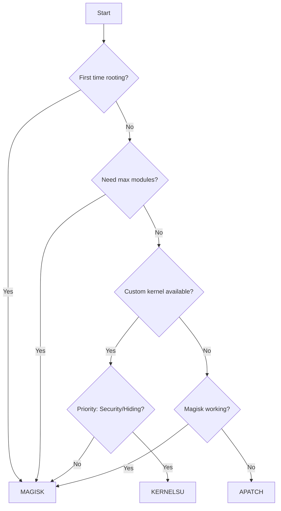

# Root Framework Comparison 2026

Comprehensive analysis of Magisk, KernelSU, and APatch to help you choose the right root solution for your Android device.

## Quick Navigation

- [Quick Comparison](#quick-comparison)
- [Framework Analysis](#framework-analysis)
- [Device Recommendations](#device-recommendations)
- [Technical Deep Dive](#technical-deep-dive)
- [Migration Guide](#migration-guide)
- [Decision Framework](#decision-framework)

**Related Guides:**
- [Main Rooting Guide](./index.md)
- [Magisk Installation](./magisk-guide.md)
- [KernelSU Installation](./kernelsu-guide.md)
- [APatch Installation](./apatch-guide.md)

---

## Quick Comparison

| Aspect | Magisk | KernelSU | APatch |
|--------|--------|----------|---------|
| **Target Users** | Most users | Advanced users | Tinkerers / edge cases |
| **Setup Difficulty** | Easy | Moderate | Moderate |
| **Official Support Scope** | Android 6.0+ | GKI 2.0 devices (kernel 5.10+); manual builds for some older kernels | ARM64 only, kernel 3.18-6.12 |
| **Kernel Requirements** | Stock/custom boot image patching | Kernel support required (built-in or patched) | KernelPatch/APatch compatibility required |
| **Root Hiding** | Good with careful setup | Often strong in practice | Device-dependent |
| **Community Size** | Largest | Growing rapidly | Small |
| **Development Status** | Active upstream | Very active | Active |
| **OTA Updates** | Usually requires re-patch | Can survive some OTA flows, not guaranteed | Usually requires re-patch |
| **Best Feature** | Ecosystem and compatibility | Kernel-level control and profiles | Alternative path when others fail |

### Quick Decision Matrix

| Choose Framework | When You Need |
|-----------------|---------------|
| **Magisk** | • First-time rooting • Broadest guide/module coverage • Fast troubleshooting via community |
| **KernelSU** | • Supported kernel available • Strong app-level root control needs • You prefer kernel-first architecture |
| **APatch** | • Magisk/KernelSU path is blocked • You have a known compatible ARM64 device • You need APatch-specific behavior |

---

## Framework Analysis

### Magisk
**The Industry Standard**

**Architecture:** Boot image modification with systemless implementation via Zygisk

**Strengths:**
- Largest module ecosystem and compatibility footprint
- Extensive documentation and community support
- Broad device compatibility
- User-friendly interface and management
- Mature, stable codebase

**Limitations:**
- Requires boot image re-patching after OTA
- Play Integrity bypass is inconsistent and changes frequently

**Installation:** [📖 Magisk Guide](./magisk-guide.md)

---

### KernelSU
**Kernel-Level Root Solution**

**Architecture:** Direct kernel integration with modern **metamodule**-based module flow

**Strengths:**
- Superior security through kernel isolation
- Better performance (kernel-space operations)
- Fine-grained app profiles and privilege controls
- Survives some OTA updates
- Strong root visibility control for non-authorized apps

**Limitations:**
- Requires kernel support (GKI 2.0 preferred upstream)
- Device availability depends on kernel/community ports
- Magisk module compatibility varies by module and metamodule setup
- More complex initial setup

**Installation:** [📖 KernelSU Guide](./kernelsu-guide.md)

---

### APatch
**Alternative Patching Method**

**Architecture:** KernelPatch-based root framework with APModule and kernel patch capabilities

**Strengths:**
- Works where Magisk fails
- Supports powerful kernel-level patch workflows (advanced users)
- Growing device support

**Limitations:**
- ARM64-only support
- Kernel support constraints (officially documented kernel range)
- Smallest module ecosystem
- Documentation is improving but still less complete than Magisk/KernelSU
- Less mature codebase
- Smaller community

**Installation:** [📖 APatch Guide](./apatch-guide.md)

---

## Device Recommendations

### Major Manufacturers

| Brand | Primary Choice | Alternative | Critical Notes |
|-------|---------------|-------------|----------------|
| **Google Pixel** | Magisk | KernelSU¹ | Best overall support |
| **Samsung Galaxy** | Magisk | APatch² | ⚠️ Knox trips permanently |
| **Xiaomi/Redmi/POCO** | Magisk³ | KernelSU⁴ | ROM-dependent |
| **OnePlus** | Magisk | KernelSU | Both work excellently |
| **Nothing Phone** | Magisk | KernelSU | Active development |
| **Motorola** | Magisk | APatch | Check bootloader policy per region |
| **ASUS ROG/Zenfone** | Magisk | KernelSU | Gaming optimizations available |
| **Realme/OPPO** | Magisk | APatch | Region/firmware quirks are common |

¹ Requires custom kernel  
² For problematic devices  
³ Stock MIUI/HyperOS  
⁴ Custom ROMs preferred

::: warning SAMSUNG KNOX
Bootloader unlock permanently trips Knox eFuse, disabling Samsung Pay, Secure Folder, and Samsung Pass forever - regardless of root method.
:::

---

## Technical Deep Dive

### Security Architecture

| Security Feature | Magisk | KernelSU | APatch |
|-----------------|--------|----------|---------|
| **Permission Model** | App-based | Profile-based | App-based |
| **UID/GID Control** | Standard `su` control | Fine-grained profile controls | Standard `su` + key-based model |
| **Namespace Isolation** | No | Yes | No |
| **Module Verification** | Varies by module source | Better structured metamodule flow | Varies by module source |
| **Root Access Control** | Standard | Advanced | Standard |

### Module Ecosystem

| Metric | Magisk | KernelSU | APatch |
|--------|--------|----------|---------|
| **Available Modules** | Largest catalog | Medium, growing | Smallest catalog |
| **Cross-Compatibility** | Native | Many Magisk modules can work (not all) | Some Magisk-style modules can work |
| **Popular Modules** | Broad availability | Good coverage on common modules | More limited selection |
| **Update Frequency** | Regular | Active | Varies |

### Root Detection Evasion

| Detection Method | Magisk | KernelSU | APatch |
|-----------------|--------|----------|---------|
| **Basic Integrity** | Sometimes possible⁵ | Sometimes possible⁵ | Sometimes possible⁵ |
| **Device Integrity** | Inconsistent | Inconsistent | Inconsistent |
| **Strong Integrity** | Generally not reliable on unlocked/rooted devices | Generally not reliable | Generally not reliable |
| **Banking Apps** | App/device dependent | App/device dependent | App/device dependent |
| **Gaming Anti-Cheat** | Hit/miss | Hit/miss | Hit/miss |

⁵ Typically requires extra tooling/modules and frequent retuning as detections change.

---

## Migration Guide

### Pre-Migration Checklist
- [ ] Full device backup created
- [ ] Module list documented
- [ ] Stock boot image available
- [ ] Recovery access confirmed
- [ ] Critical apps tested

### Migration Paths

<b>Magisk → KernelSU</b> (1-2 hours)

1. **Backup & Document** (cloud/app exports + internal storage copy)
2. **Uninstall Magisk completely**
3. **Flash KernelSU-enabled kernel**
4. **Install KernelSU Manager**
5. **Reinstall compatible modules**
6. **Configure app profiles**

<b>Magisk → APatch</b> (30-60 minutes)

1. **Create full backup**
2. **Uninstall Magisk**
3. **Flash APatch boot image**
4. **Install APatch Manager**
5. **Verify root access**
6. **Install essential modules**

<b>KernelSU → Magisk</b> (30-60 minutes)

1. **Document KernelSU modules**
2. **Flash stock/ROM boot image**
3. **Patch with Magisk**
4. **Flash patched boot**
5. **Reinstall modules from Magisk repo**

---

## Decision Framework

### Use Case Scenarios

| Scenario | Recommended | Reason |
|----------|-------------|---------|
| **Daily Driver Phone** | Magisk | Stability & support |
| **Gaming Device** | Magisk / KernelSU | Depends heavily on title anti-cheat behavior |
| **Development/Testing** | KernelSU | Advanced features |
| **Banking Phone** | No root preferred | Highest reliability for financial apps |
| **Problematic Device** | APatch | Alternative approach |
| **Learning Rooting** | Magisk | Best documentation |

---

## Frequently Asked Questions

<b>Essential FAQs</b>

**Q: Can I switch between methods?**  
A: Yes, but requires uninstalling current method and clean installation of new one.

**Q: Which has best Play Integrity bypass?**  
A: None can guarantee passing all tiers. Results vary by device fingerprint, ROM state, bootloader status, and current detection updates.

**Q: Do all Magisk modules work on KernelSU?**  
A: No. Many work, but compatibility depends on module design and whether required metamodules are present.

**Q: Which method is safest?**  
A: All are safe when properly installed. KernelSU offers best architectural security.

**Q: Will OTA updates work?**  
A: Expect to re-check root after every OTA on all frameworks. Some KernelSU setups survive specific OTA flows, but this is not guaranteed.

**Q: Battery impact?**  
A: Negligible for all methods. Module choice matters more.

---

## Community Resources

### Official Channels
- **Magisk:** [GitHub](https://github.com/topjohnwu/Magisk) | [Official Docs](https://topjohnwu.github.io/Magisk/) | [XDA](https://forum.xda-developers.com/f/magisk.5903/)
- **KernelSU:** [GitHub](https://github.com/tiann/KernelSU) | [Docs](https://kernelsu.org/) | [Telegram](https://t.me/KernelSU)
- **APatch:** [GitHub](https://github.com/bmax121/APatch) | [Docs](https://apatch.dev/) | [Telegram](https://t.me/APatchGroup)

### General Support
- [XDA Developers Forums](https://forum.xda-developers.com/)
- [r/AndroidRoot](https://www.reddit.com/r/androidroot/)
- Device-specific Telegram groups

---

## Final Recommendations

### For Most Users
**Start with Magisk** - best documentation, easiest recovery path, broad support

### For Power Users
**Consider KernelSU** if your device/kernel is supported and you want deeper root control

### For Edge Cases
**Try APatch** when Magisk/KernelSU paths are blocked on your specific firmware

### Universal Tips
1. Research device-specific quirks first
2. Maintain proper backups always
3. Test one module at a time
4. Join device-specific communities
5. Keep stock boot image handy

---

> [!TIP]
> Don't want to root? Check out our [Non-Root Alternatives Guide](../non-root-alternatives.md) for alternatives to enhance your Android experience without rooting.

---

## Next Steps

1. **Choose your method** based on this comparison
2. **Follow installation guide:**
   - [Magisk Guide](./magisk-guide.md)
   - [KernelSU Guide](./kernelsu-guide.md)
   - [APatch Guide](./apatch-guide.md)
3. **Install essential apps:** [Root Apps Collection](../apps-and-modules/)
4. **Get support:** Join relevant communities

---

*Remember: The "best" method depends entirely on your specific device, technical comfort, and use case. When in doubt, start with Magisk.*